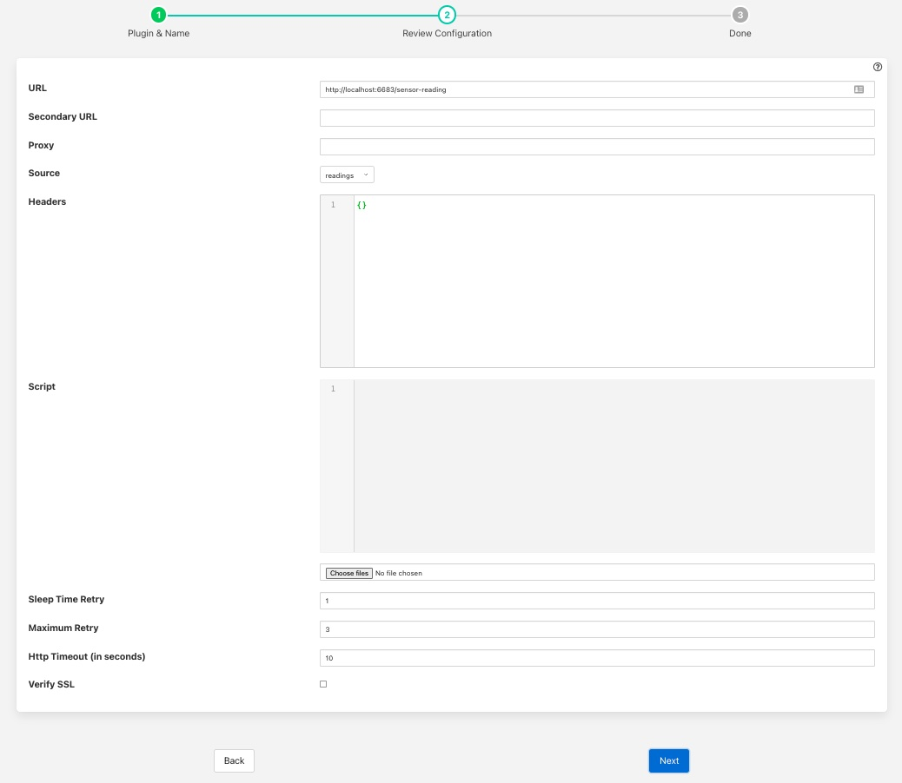

.. Images

.. Links
.. |http-python| raw:: html

   <a href="../fledge-north-http_north/index.html">Python version</a>

.. |http-south| raw:: html

   <a href="../fledge-south-http_south/index.html">South service</a>

North HTTP-C
============

The *fledge-north-http-c* plugin allows data to be sent from the north of one Fledge instance into the south of another Fledge instance. It allows hierarchies of Fledge instances to be built. The Fledge to which the data is sent must run the corresponding |http-south| in order for data to flow between the two Fledge instances. The plugin supports both HTTP and HTTPS transport protocols and sends a JSON payload of reading data in the internal Fledge format.

Additionally this plugin allows for two URL's to be configured, a primary URL and a secondary URL. If the connection to the primary URL fails then the plugin will switch over to using the secondary URL. It will switch back if the connection to the secondary fails or if when the north task completes and a new north task is later run.

The plugin may also be used to send data from Fledge to another system, the receiving system should implement a REST end point that will accept a POST request containing JSON data. The format of the JSON payload is described below. The required REST endpoint path is defined in the configuration of the plugin.

Filters may be applied to the connection in either the north task that loads this plugin or the receiving south service on the up stream Fledge.

A |http-python| plugin exists also that performs the same function as this plugin, the pair are provided for purposes of comparison and the user may choose whichever they prefer to use.

To create a north task to send to another Fledge you should first create the |http-south| that will receive the data. Then create a new north tasks by;

  - Selecting *North* from the left hand menu bar.

  - Click on the + icon in the top left

  - Choose httpc from the plugin selection list

  - Name your task

  - Click on *Next*

  - Configure the HTTP-C plugin

    +----------+
    | |http_1| |
    +----------+

    - **URL**: The URL of the receiving |http-south|, the address and port should match the service in the up stream Fledge. The URL can specify either HTTP or HTTPS protocols.

    - **Secondary URL**: The URL to failover to if the connection to the primary URL fails. If failover is not required then leave this field empty.

    - **Source**: The data to send, this may be either the reading data or the statistics data

    - **Proxy**: The host and port of the proxy server to use. Leave empty is a proxy is not in use. This should be formatted as an address followed by a colon and then the port or a hostname followed by a colon and then the port. E.g. 192.168.0.42:8080. If the default port is used then the port may be omitted.

    - **Headers**: An optional set of header fields to send in every request. The headers are defined as a JSON document with the name of each item in the document as header field name and the value the value of the header field.

    - **Script**: An optional Python script that can be used to convert the payload format. If given the script should contain a method called *convert* that will be passed a single reading as a JSON DICT and must return the new payload as a string.

    - **Sleep Time Retry**: A tuning parameter used to control how often a connection is retried to the up stream Fledge if it is not available. On every retry the time will be doubled.

    - **Maximum Retry**: The maximum number of retries to make a connection to the up stream Fledge. When this number is reached the current execution of the task is suspended until the next scheduled run.

    - **Http Timeout (in seconds)**: The timeout to set on the HTTP connection after which the connection will be closed. This can be used to tune the response of the system when communication links are unreliable.

    - **Verify SSL**: When HTTPS rather the HTTP is used this toggle allows for the verification of the certificate that is used. If a self signed certificate is used then this should not be enabled.

  - Click *Next*

  - Enable your task and click *Done*

Header Fields
-------------

Header fields can be defined if required using the *Headers* configuration item. This is a JSON document that defines a set of key/value pairs for each header field. For example if a header field *token* was required with the value of *sfe93rjfk93rj* then the *Headers* JSON document would be as follows

.. code-block:: console

    {
        "token" : "sfe93rjfk93rj"
    }

Multiple header fields may be set by specifying multiple key/value pairs in the JSON document.

JSON Payload
------------

The payload that is sent by this plugin is a simple JSON presentation of a set of reading values. A JSON array is sent with one or more reading objects contained within it. Each reading object consists of a timestamp, an asset name and a set of data points within that asset. The data points are represented as name value pair  JSON properties within the reading property.

The fixed part of every reading contains the following

+-----------+----------------------------------------------------------------+
| Name      | Description                                                    |
+===========+================================================================+
| ts        | The timestamp as an ASCII string in ISO 8601 extended format.  |
|           | If no time zone information is given it is assumed to indicate |
|           | the use of UTC.  This timestamp is added by Fledge when it     |
|           | first reads the data.                                          |
+-----------+----------------------------------------------------------------+
| user_ts   | The timestamp as an ASCII string in ISO 8601 extended format.  |
|           | If no time zone information is given it is assumed to indicate |
|           | the use of UTC. This timestamp is added by the device itself   |
|           | and can be used to reflect the timestamp the data refers to    |
|           | rather than the timestamp Fledge read the data.                |
+-----------+----------------------------------------------------------------+
| asset     | The name of the asset this reading represents.                 |
+-----------+----------------------------------------------------------------+
| readings  | A JSON object that contains the data points for this asset.    |
+-----------+----------------------------------------------------------------+

The content of the *readings* object is a set of JSON properties, each of which represents a data value. The type of these values may be integer, floating point, string, a JSON object or an array of floating point numbers.

A property

.. code-block:: console

    "voltage" : 239.4

would represent a numeric data value for the item *voltage* within the asset. Whereas

.. code-block:: console

    "voltageUnit" : "volts"

Is string data for that same asset. Other data may be presented as arrays

.. code-block:: console

   "acceleration" : [ 0.4, 0.8, 1.0 ]

would represent acceleration with the three components of the vector, x, y, and z. This may also be represented as an object

.. code-block:: console

   "acceleration" : { "X" : 0.4, "Y" : 0.8, "Z" : 1.0 }

both are valid formats within Fledge.

An example payload with a single reading would be as shown below

.. code-block:: console

    [
       {
           "user_ts"   : "2020-07-08 16:16:07.263657+00:00",
           "ts"        : "2020-07-08 16:16:07.263657+00:00",
           "asset"     : "motor1",
           "readings"  : {
                         "voltage"  : 239.4,
                         "current"  : 1003,
                         "rpm"      : 120147
                         } 
       }
   ]

Payload Script
--------------

If a script is given then it must provide a method called *convert*, that method is passed a single reading as a Python DICT and must return a formatted string payload for that reading.

As a simple example lets assume we want a JSON payload to be sent, but we want to use different keys to those in the default reading payload. We will replaces *readings* with *data*, *user_ts* with *when* and *asset* with *device*. A simple Python script to do this would be as follows;

.. code-block:: python

   import json
   def convert(reading):
       newReading = {
          "data" : reading["readings"],
          "when" : reading["user_ts"],
          "device" : reading["asset"],
       }
       return json.dumps(newReading)

An HTTP request would be sent with one reading per request and that reading would be formatted as a JSON payload of the format

.. code-block:: console

   {
       "data":
       {
           "sinusoid": 0.0,
           "sine10": 10.0
       },
        "when": "2022-02-16 15:12:55.196494+00:00",
        "device": "sinusoid"
   }

Note that white space and newlines have been added to improve the readability of the payload.

The above example returns a JSON format payload, the return may however not be encoded as JSON, for example an XML payload

.. code-block:: python

   from dict2xml import dict2xml
   def convert(reading):
       newReading = {
          "data" : reading["readings"],
          "when" : reading["user_ts"],
          "device" : reading["asset"],
       }
       payload = "<reading>" + dict2xml(newReading) + "</reading>"
       return payload

This return XML format data as follows

.. code-block:: console

   <reading>
      <data>
        <sine10>10.0</sine10>
        <sinusoid>0.0</sinusoid>
      </data>
      <device>sinusoid</device>
      <when>2022-02-16 15:12:55.196494+00:00</when>
    </reading>

Note that white space and formatting have been added for ease of reading the XML data. You must also make sure you have installed the Python XML support as this is not normally installed with Fledge, To do this run

.. code-block:: console

   pip3 install dict2xml

from the command line of the Fledge machine.
